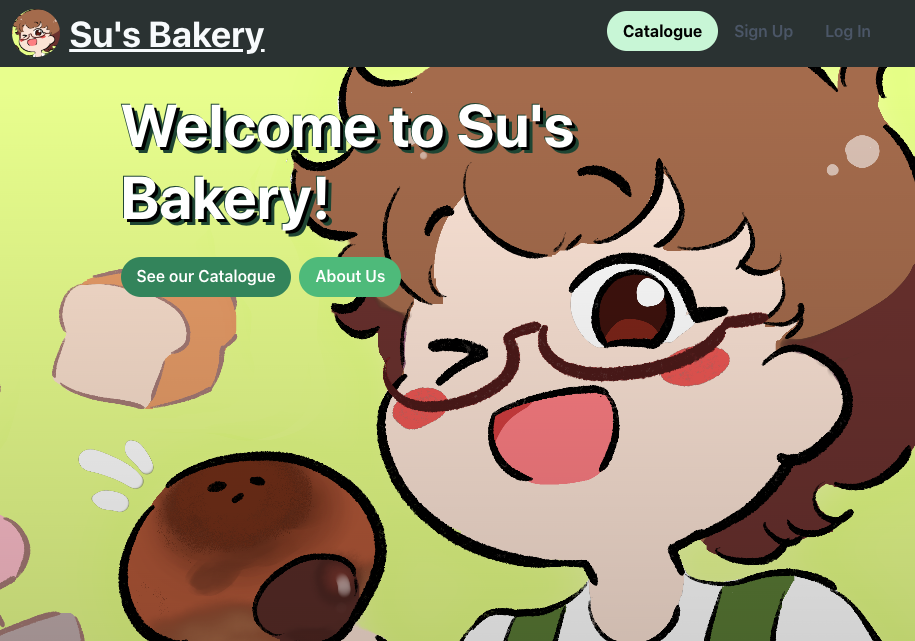
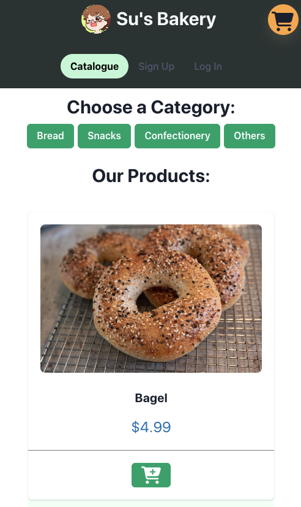

# Local Bakery - Online Webpage

[Deployed Link](https://su-bakery-v1-9252c425e38d.herokuapp.com/)

## Description

This project is demonstration of my skills and knowledge as a full-stack developer, built using the MERN Stack.

## Credits

Codes provided in the University of Adelaide Full-Stack Development bootcamp (course ID: UADEL-VIRT-FSF-PT-03-2023-U-LOLC-MTTH) was used as initial references & starting point in building the website.

The website is based on a real-life business, shout-out to my mother; for providing the idea for the project & being supportive throughout my studies!

### Notable technologies used (not limited to this list)

* Icons by [FontAwesome](https://fontawesome.com/)
* Component Library: [Chakra](https://chakra-ui.com/) & [Chakra Templates](https://chakra-templates.dev/)
* [Pretty Shadow](https://freefrontend.com/css-text-shadow-effects/) (CSS Styling) by Alex Moore

## License

